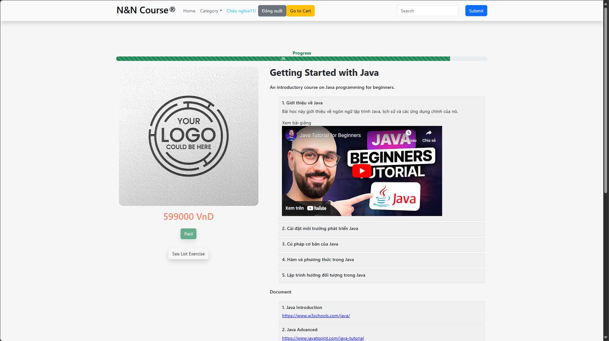
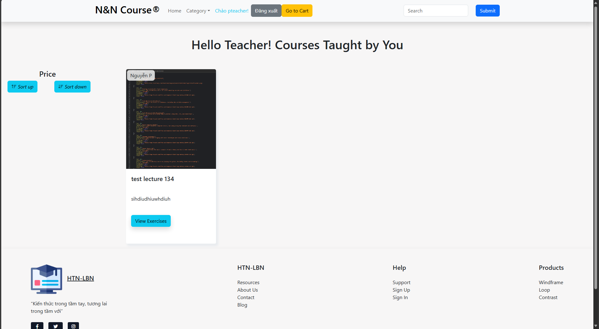

# Online-Course

## Project Description
This project is an online course management system developed using the Spring Framework with the MVC model for admin management. The system also leverages a RESTful API architecture to provide backend services. On the frontend, ReactJS is used to build the user interface.

_The project is still under development._
## Database
### EER diagram in MySQL


## Install
To ensure the app runs smoothly, it is recommended to use Tomcat 9.0 and JDK 17. If you are using an IDE, please use NetBeans 13 or any other compatible IDE.

_Backend_
Edit the following properties in the `database.properties` file.

```bash
...
hibernate.connection.url=your_connection #default connection is jdbc:mysql://localhost:3306/your_database_name
hibernate.connection.username=your_database_username
hibernate.connection.password=your_database_password
```

_Frontend_

We use npm for manage package.
```bash
install npm
```
Run project
```bash
npm start
```


## Usages

_Admin interface_

<div style="display: flex; justify-content: space-between;">
  
  
  
  
  
  
</div>


_User interface_

<div style="display: flex; justify-content: space-between;">
  
  
</div>

_Student interface_

<div style="display: flex; justify-content: space-between;">
  
  
  
  
</div>

_Instructor interface_

<div style="display: flex; justify-content: space-between;">
  
  
  
  
</div>
