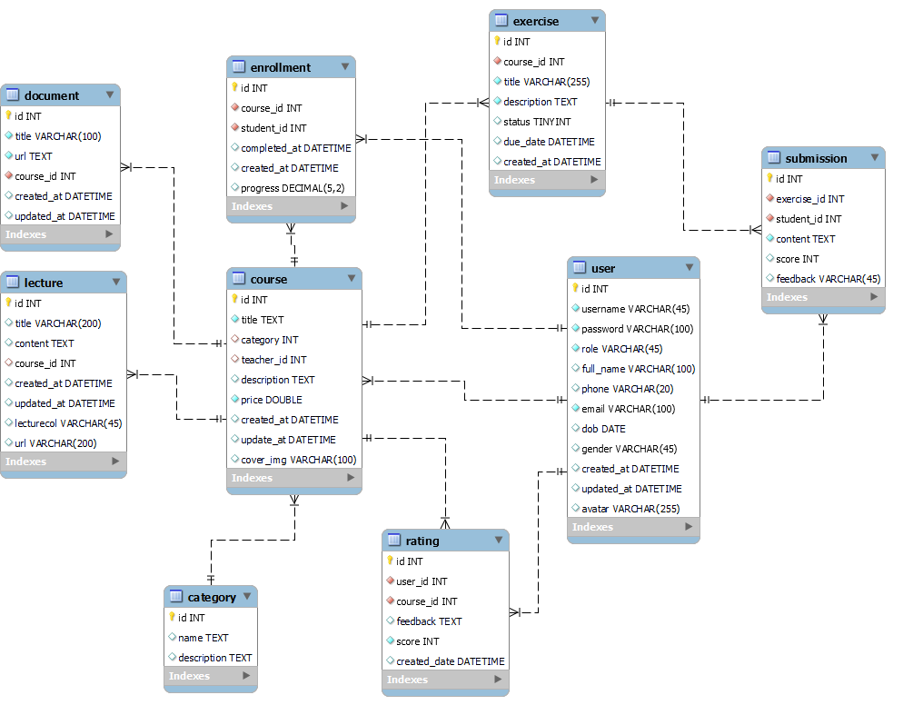
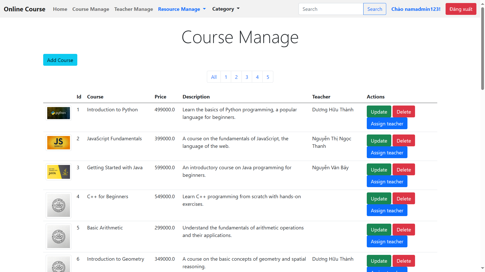

# Online-Course

## Overview
This project is an online course management system developed using the Spring Framework with the MVC model for admin management. The system also leverages a RESTful API architecture to provide backend services. On the frontend, ReactJS is used to build the user interface.

## Database

### Usages

_Admin interface_

  
  
  
  
  
  

